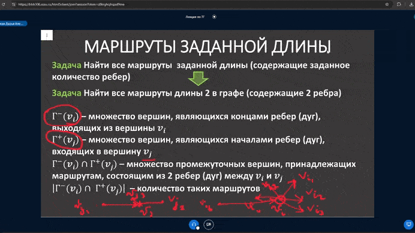

# BBB Slide Presentation Downloader

**BBB Slide Presentation Downloader** позволяет скачивать презентации из BigBlueButton (BBB) в формате PDF. Это удобный инструмент для сохранения слайдов с вебинаров или онлайн-курсов.

**Внимание:** Основной задачей было познакомиться с GitHub Actions Workflow, а не написать идеально рабочее приложение

## Основные функции

- Скачивание всех слайдов презентации.
- Выбор начального и конечного слайдов для скачивания.
- Автоматическая конвертация SVG слайдов в PDF.
- Поддержка темной и светлой темы интерфейса.

## Использование

1. Сохраните ссылку на презентацию BigBlueButton как показано в видеоинструкции.
   

2. Вставьте ссылку в поле "Ссылка на презентацию".
3. Выберите, хотите ли вы скачать все слайды или указать начальный и конечный слайды.
4. Укажите имя файла для сохранения.
5. Нажмите "Скачать презентацию".

## Установка и запуск

### Требования

#### Запуск через Node.JS (Local)

1. Установите Node.JS.
2. Клонируйте репозиторий:

```bash
git clone https://github.com/dauxdu/bbb_spd.git
```

3. Перейдите в папку с проектом и запустите командой:

```bash
node server.js
```

4. Перейдите в браузере по адресу: http://localhost:3000

#### Запуск через Docker (Local)

1. Установить Docker
2. Клонируйте репозиторий:

```bash
git clone https://github.com/dauxdu/bbb_spd.git
```

3. Перейдите в папку с проектом и соберите Docker-образ

```bash
docker build -f docker/Dockerfile -t bbb-spd .
```

4. Запустите контейнер

```bash
docker run -d -p 3000:3000/tcp --name bbb-spd bbb-spd
```

5. Перейдите в браузере по адресу: http://localhost:3000

#### Запуск с помощью Docker Compose (Self-Hosting)

1. Установить Docker

2. Клонируйте репозиторий:

```bash
git clone https://github.com/dauxdu/bbb_spd.git
```

3. Создайте сеть

```bash
docker network create traefik-private
```

4. Перейдите в папку с проектом и запустите контейнеры:

```bash
 docker compose up -d
```

5. Откройте веб-интерфейс в браузере

http://localhost

## Структура проекта

```
bbb-spd/
├── public/
│   ├── index.html
│   ├── script.js
│   ├── styles.css
├── compose.yml
├── Dockerfile
├── package-lock.json
├── package.json
├── server.js
└── stack.yml
```

## Лицензия

Этот проект распространяется под лицензией MIT. Подробности см. в файле LICENSE.
