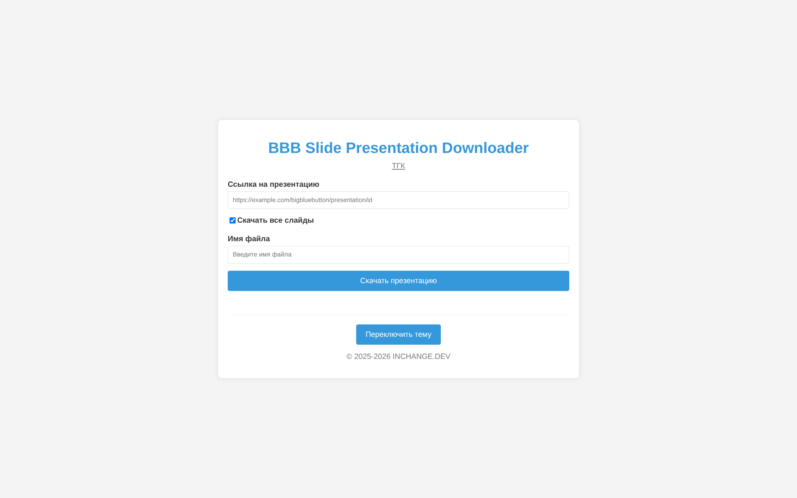
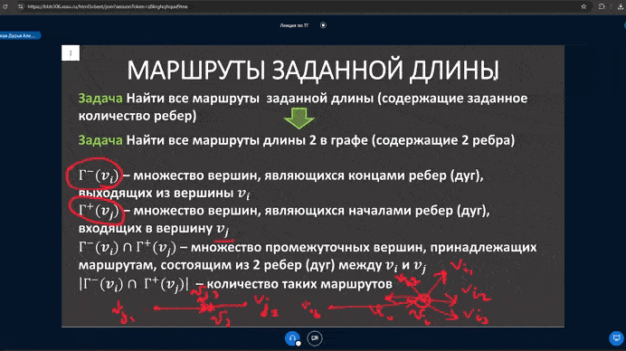

# BBB Slide Presentation Downloader

[](LICENSE)

**BBB Slide Presentation Downloader** — инструмент для скачивания презентаций из BigBlueButton (BBB) в формате PDF. Удобное решение для сохранения слайдов с вебинаров, лекций и онлайн-курсов.

> [!WARNING]
> Основная цель проекта — изучение GitHub Actions Workflow, а не создание производственно-готового приложения.

## Основные возможности



- Загрузка всех слайдов презентации одним архивом или выбор диапазона
- Автоматическое преобразование слайдов в `.pdf` формат

## Быстрый старт

### Предварительные требования

- **Вариант 1**: [Node.js](https://nodejs.org/) версии 22.x или выше
- **Вариант 2**: [Docker](https://docs.docker.com/get-docker/) + [Docker Compose](https://docs.docker.com/compose/install/)

### Запуск через Node.js (локально)

```bash
# 1. Клонируйте репозиторий
git clone https://github.com/Dauxdu/bbb-spd.git
cd bbb-spd

# 2. Установите зависимости
npm install

# 3. Запустите сервер
node server.js

# 4. Откройте в браузере
# http://localhost:3000
```

### Запуск через Docker (локально)

```bash
# 1. Клонируйте репозиторий
git clone https://github.com/Dauxdu/bbb-spd.git
cd bbb-spd/docker

# 2. Запустите контейнер
docker compose up -d --build

# 3. Откройте в браузере
# http://localhost:3000
```

1. **Скопируйте ссылку на презентацию** BigBlueButton
   

2. **Вставьте ссылку** в поле «Ссылка на презентацию»

3. **Настройте параметры загрузки**:
   - **Все слайды** — скачать всю презентацию
   - **Диапазон** — укажите `Начальный слайд` и `Конечный слайд` для выборочной загрузки

4. **Задайте имя файла**

5. Нажмите **«Скачать презентацию»** и дождитесь завершения генерации

## Структура проекта

```
bbb-spd/
├── docker/
│ ├── compose.yml
│ ├── Dockerfile
│ └── stack.yml
├── public/
│ ├── index.html
│ ├── script.js
│ └── styles.css
├── package.json
├── package-lock.json
├── server.js
```

## Лицензия

Проект распространяется под лицензией **MIT**.  
Вы можете свободно использовать, изменять и распространять код при условии сохранения уведомления об авторских правах.

Подробнее: [LICENSE](LICENSE)
